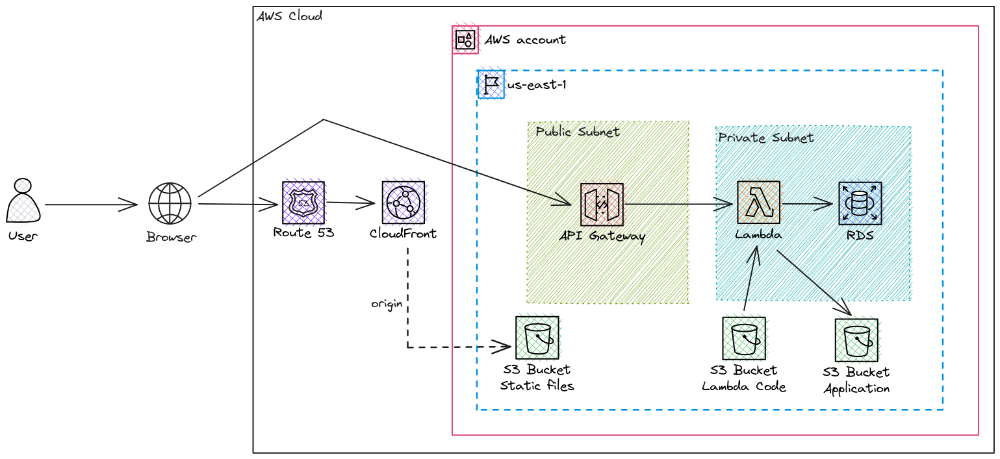

# Serverless Architecture

The goal of this project is to create a serverless architecture in AWS, deploying a static website through CloudFront (using S3 as origin), an API in a Lambda, and a database using RDS (I'm not using Serverless Aurora because I plan to use this in a personal project and serverless aurora was gonna be more expensive than a RDS DB instance).

## Architecture



## How to run this project?

### Pre-requisites
Some configurations and resources are expected to be set before you run this project.

1) Route53 should be properly configured
If you have a domain, make sure that this domain is being managed by Route53. So if you bought your domain from GoDaddy, NameCheap, or other registrars, you will need to allow Route53 to manage your domain.

2) Create a S3 bucket to store the Terraform state file
Manually create an S3 bucket, we will use this bucket to store the state file of the Terraform.

### Expected errors
It's expected to face some errors when trying to run the entire infra at first.

This module creates the S3 Bucket that will store the lambda function code and at the same time create the Lambda from a ZIP package of this Bucket. It's clear that once the bucket is created the bucket is empty. So you must run the CI (or manually push) that pushes the zipped code to S3 after the error. After that, you can rerun the terraform and everything is expected to work.

Remember to also do the same for the S3 bucket that will store the static website! This one will not raise any errors but if you try to access the frontend without pushing the files to the bucket the website will not work.

### Running the project

1) Set the Terraform backend
Go to the `versions.tf` file and change the backend configuration to point to the S3 Bucket that you created manually to store the terraform state.

2) Create your `terraform.tfstate` file
You can read the `README_TERRAFORM.md` file to check all the variables accepted by the code.

A possible example of the variables file:
```ini
## COMMON
aws_region = "us-west-2"
domain_name = "felipetrindade.com"

## FRONTEND
frontend_bucket_name = "static-frontend-flat"
frontend_subdomain = "admin"

## BACKEND
backend_subdomain = "api"
backend_s3_bucket_name = "lambdas-code-flat"
backend_s3_bucket_name_application = "api-bucket-flat"

backend_lambda_name = "api"
backend_lambda_s3_object = "api.zip"
backend_lambda_memory_in_MB = 512
backend_api_gateway_name = "api-gateway"

## DATABASE
database_identifier = "api-database"
database_requested_storage_in_GiB = 20
database_max_storage_in_GiB = 30
database_name = "app"
database_engine_version = "8.0"
database_password = "12341234"
database_instance_class = "db.t4g.micro"
backend_lambda_environments_variables = {
    USER = "root",
    PASSWORD = "12341234",
    BATABASE = "app"
    LOGGER_LEVEL = "DEBUG"
}
```

3) Create the infrastructure using Terraform
```bash
terraform init
terraform apply -var-file="terraform.tfvars"
```